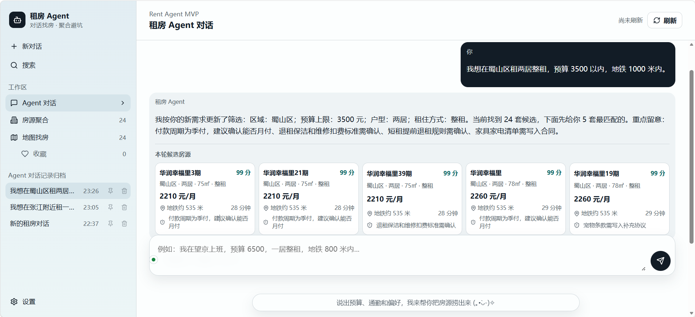
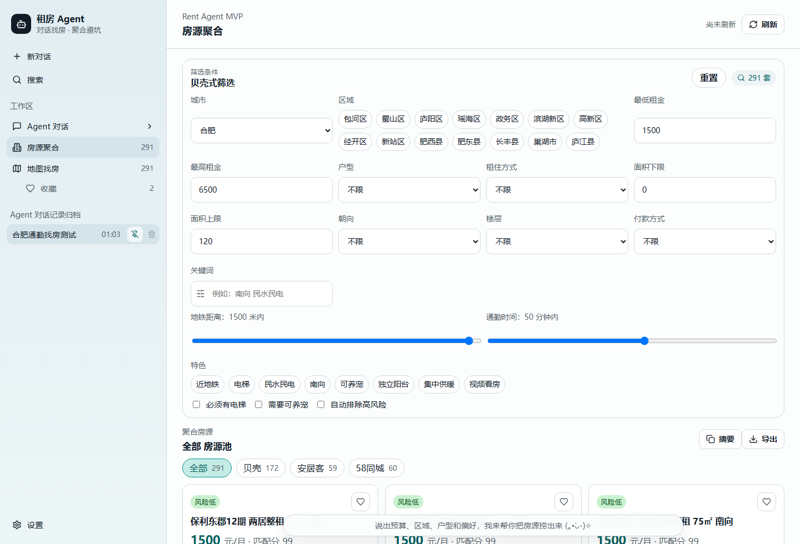
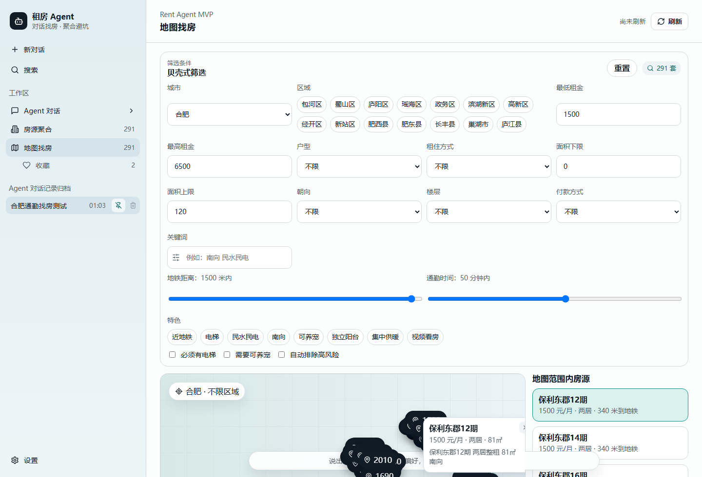
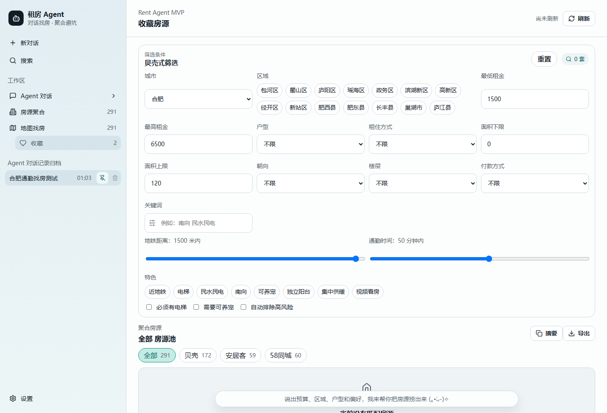
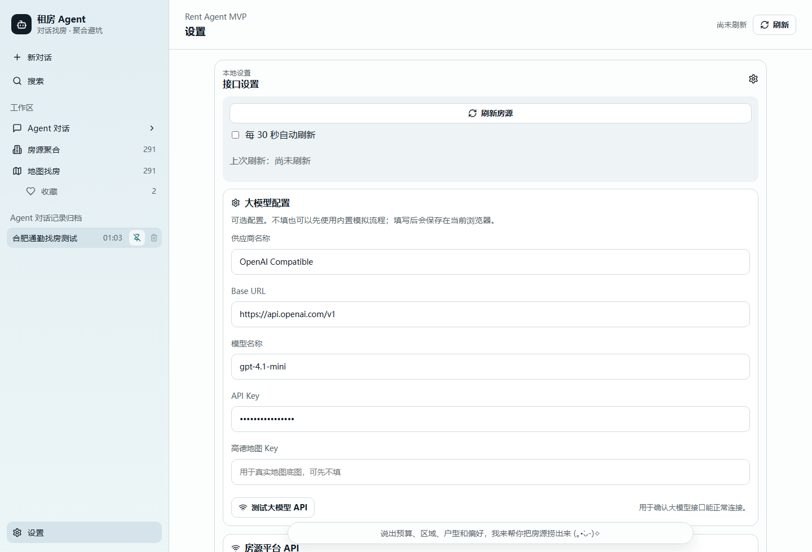

# Rent Agent

Rent Agent 是一个租房辅助工具，用于根据预算、位置、通勤、偏好等条件整理房源，并通过筛选、评分、收藏和对话面板帮助用户比较候选房源。

## 功能概览

- 房源列表、筛选条件和匹配评分
- 租房偏好与会话记忆本地保存
- 收藏、导出和摘要复制
- 设置页配置大模型 API
- 设置页配置房源平台 API，支持只配置一个平台
- Node.js 服务端代理外部 API，避免把 Token 写死在源码里

## 功能截图

以下截图覆盖主要功能页面。

### Agent 对话

### 房源聚合与筛选

### 地图找房

### 收藏房源

### 设置与 API 配置

## 目录

- `src/`：前端界面、数据和租房评分逻辑
- `server/`：Node.js 服务端和 API 代理
- `docs/`：需求、设计、测试和部署说明
- `.env.example`：环境变量示例，当前设置页也可直接配置平台 API
